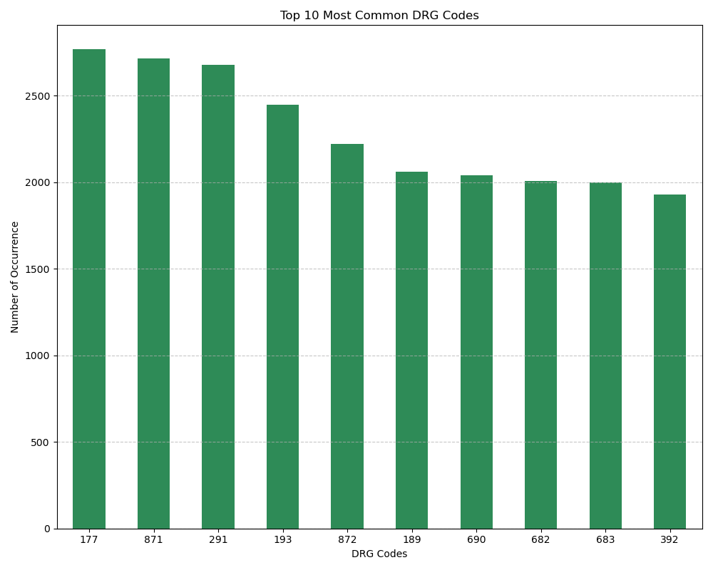
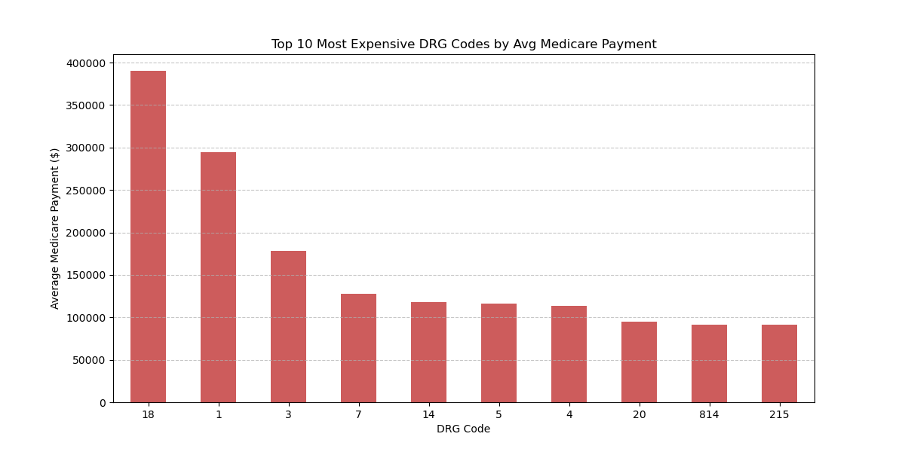
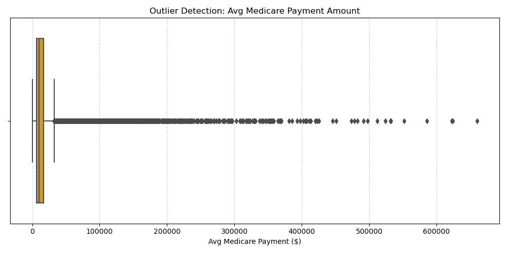
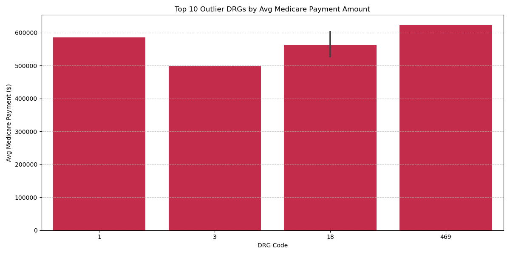
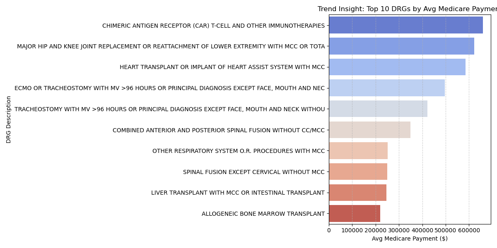

**Healthcare Hospital Cost Analysis (US Medicare Dataset)**
**Overview**
This project analyzes 2022 Medicare hospital cost data across the U.S., with a focus on Diagnosis-Related Groups (DRGs). We identified cost patterns, frequently occurring diagnoses, and outliers to provide actionable insights for healthcare cost optimization. Visualizations and structured summaries help stakeholders easily digest trends and disparities in average Medicare payments.

**Dataset**

Source: U.S. Centers for Medicare & Medicaid Services
Raw Dataset: Medicare_data - 2022.csv
Rows: 145,742
Columns: 15
Scope: DRG-level charges and payments by provider

**Analysis Summary**

1-Top 10 Most Common DRG Codes
Counted the number of times each DRG appeared to find the most frequently billed ones and the results are-
DRG codes like 177 (Respiratory infections) and 871/872 (Septicemia) dominate the list.
These diagnoses are consistently common and drive much of Medicare's hospital volume.

2. Top 10 Most Expensive DRGs
Calculated the average Medicare payment by DRG and selected the top 10 and the results are-
DRG 18 (CAR-T cell therapy) and DRG 1 (Heart transplants) have the highest average reimbursements, reflecting their complex nature and cost.
All entries here involve highly specialized or life-saving procedures.

3. Outlier Detection: identified outliers in average Medicare payments and insights are -
A large number of records sit far outside the whiskers, confirming the presence of cost outliers.
Further filtering is needed to explore those high-cost procedures.

4. Outlier DRGs (99th Percentile Filtered)
Isolated the top 1% of DRGs based on Medicare payment and visualized the top 10.
DRG 18 (CAR-T therapy) shows up repeatedly with very high costs, often exceeding $600,000+.
Other top outliers include Heart and Lung transplants.

5. Trend Analysis by DRG Description
Highlighted high-cost DRGs with distinct medical narratives.
Complex procedures like ECMO, spinal fusion, and transplants continue to top the list.
This visualization emphasizes diverse types of high-cost care, not just a few DRG codes.

**Visualization**

**Key Business Insights**

Frequent DRGs like respiratory conditions drive a majority of volume but not necessarily cost.
DRG 18 (CAR-T) appears in both highest average and outlier lists, signaling a cost hotspot.
Procedures with higher complexity and risk (e.g., transplants) consistently receive top-tier payments.
Target High-Cost DRGs for OversightCAR-T therapy and transplants have the highest per-case costs. These DRGs should be reviewed for cost containment, potentially using bundled payments.
Address High-Frequency, Lower-Cost DRGs with Efficiency MeasuresRespiratory infections and sepsis occur most often. Preventative care and efficient treatment pathways in these cases could significantly reduce total spend.
Outlier Detection Enables Financial Risk ManagementIdentifying DRGs above the 99th percentile allows hospitals and payers to flag abnormal billing activity or rare but impactful procedures.
Use DRG-Level Data to Guide StrategyThis analysis shows how DRG-level transparency can help optimize provider performance, reimbursement models, and case management.

**Recommendations**
1. Focus Financial Oversight on High-Cost DRGs
Hospitals should closely monitor procedures like CAR-T cell therapy, organ transplants, and ECMO that consistently appear among the highest-cost DRGs. These cases should undergo periodic cost audits and efficiency reviews to ensure they align with Medicare reimbursement goals.

2. Implement Pre-Authorization or Clinical Review for Outlier Procedures
High-cost outlier procedures can significantly skew hospital finances. Hospitals are advised to implement clinical checkpoints, cost-preauthorization processes, or internal medical necessity reviews for DRGs that consistently exceed the 99th percentile threshold.

3. Streamline Treatment Pathways for High-Volume DRGs
For frequently billed DRGs such as sepsis and respiratory infections, hospitals should invest in protocol standardization and early intervention strategies. This will reduce readmissions, optimize resource allocation, and improve cost-efficiency.

4. Use DRG-Level Data for Case Management Strategy
Hospitals can improve patient outcomes and billing accuracy by integrating DRG-level insights into their case management strategy. High-cost and high-volume DRGs should trigger more proactive engagement from case managers and discharge planners.

5. Plan for Value-Based Reimbursement Shifts
To prepare for ongoing policy shifts, hospitals should identify DRGs suitable for bundled payments or value-based contracts. Beginning with DRGs that are already high-cost or high-frequency will yield the greatest initial impact.

**Conclusion**

This analysis helps stakeholders identify where Medicare is spending the most, which DRGs are driving volume, and where unexpected cost spikes occur. These insights are critical for improving hospital operations, reimbursement strategies, and policy planning.

Created by: Tabassum Arshad
Tools Used: Python, Pandas, Seaborn, Matplotlib
